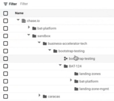
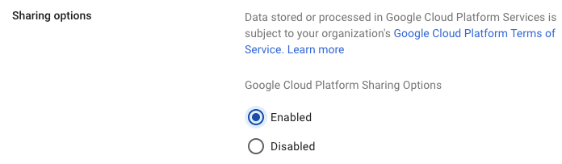
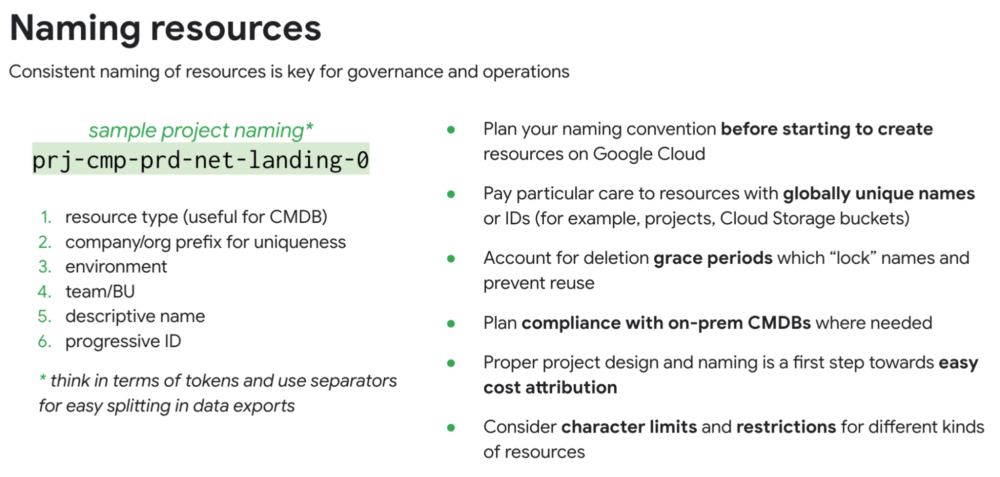
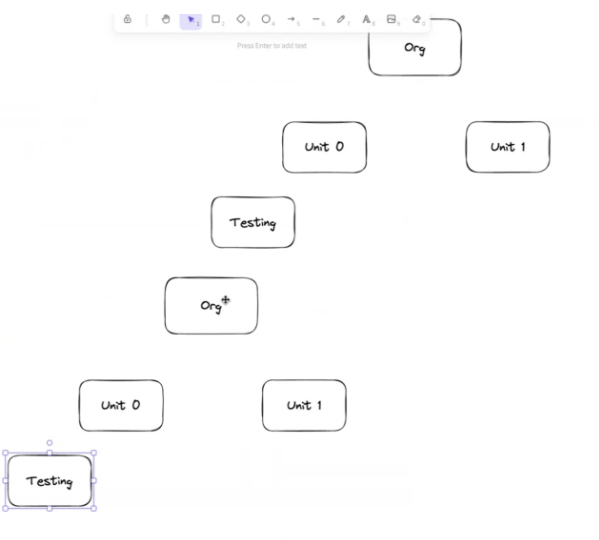
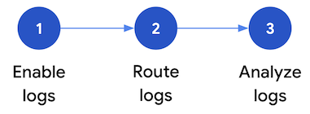
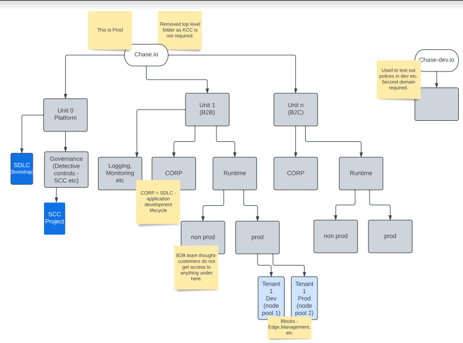

<!-- Output copied to clipboard! -->

<!-----

You have some errors, warnings, or alerts. If you are using reckless mode, turn it off to see inline alerts.
* ERRORs: 0
* WARNINGs: 0
* ALERTS: 7

Conversion time: 4.543 seconds.

Using this Markdown file:

1. Paste this output into your source file.
2. See the notes and action items below regarding this conversion run.
3. Check the rendered output (headings, lists, code blocks, tables) for proper
   formatting and use a linkchecker before you publish this page.

Conversion notes:

* Docs to Markdown version 1.0β34
* Wed Apr 26 2023 00:44:37 GMT-0700 (PDT)
* Source doc: [External][JPMC] Architecture Review
* Tables are currently converted to HTML tables.
* This document has images: check for >>>>>  gd2md-html alert:  inline image link in generated source and store images to your server. NOTE: Images in exported zip file from Google Docs may not appear in  the same order as they do in your doc. Please check the images!

WARNING:
You have 10 H1 headings. You may want to use the "H1 -> H2" option to demote all headings by one level.

----->

>>>>>  gd2md-html alert:  ERRORs: 0; WARNINGs: 1; ALERTS: 7.

<ul style="color: red; font-weight: bold"><li>See top comment block for details on ERRORs and WARNINGs. <li>In the converted Markdown or HTML, search for inline alerts that start with >>>>>  gd2md-html alert:  for specific instances that need correction.</ul>

Links to alert messages:
<a href="#gdcalert1">alert1</a>
<a href="#gdcalert2">alert2</a>
<a href="#gdcalert3">alert3</a>
<a href="#gdcalert4">alert4</a>
<a href="#gdcalert5">alert5</a>
<a href="#gdcalert6">alert6</a>
<a href="#gdcalert7">alert7</a>

>>>>> PLEASE check and correct alert issues and delete this message and the inline alerts.

# Architecture Review

[TOC]

# Status

**Todo:**

**In Progress: **Logging, IAM / Resource Hierarchy, GKE Hardening

**In Progress: **Logging, IAM / Resource Hierarchy, GKE Hardening

# Overview

Review topics relevant to the Platform Engineering BATP team to deliver the foundation landing zone in a reusable, secure and performant manner to Business Accelerator Teams.

**Guiding Principles: Shared Responsibility Model**

# Purpose

To provide clarity around the roadmap, best practices and translate requirements into Designs for the key foundational Landing Zone, that is fit for purpose for use by Business Accelerators.

The Design & Advisory workstream doesn't have tasks / stories within Sprints, as it is run independently, but it may inform the future roadmap, milestones, Epic requirements and sprint goals towards MvP and Refinement. 

The goal of the architecture review is not to bring together a large document, but digestible design decisions / records that are easily referenced and version controlled.

[https://adr.github.io/](https://adr.github.io/)

# Architecture

[Chase.io](Chase.io) Organization

>>>>>  gd2md-html alert: inline image link here (to images/image1.png). Store image on your image server and adjust path/filename/extension if necessary.  (<a href="#">Back to top</a>)(<a href="#gdcalert2">Next alert</a>) >>>>> 

Organization with different folders

"Shared" services can be enabled at the Organization level

## Onboarding

&lt;process for onboarding a new customer (business unit)>

# ADR Template

# **Title**

## 
**Status**

What is the status, such as proposed, accepted, rejected, deprecated, superseded, etc.?

## 
**Context**

What is the issue that we're seeing that is motivating this decision or change?

## 
**Decision**

What is the change that we're proposing and/or doing?

## 
**Consequences**

What becomes easier or more difficult to do because of this change?

# Landing Zone

The MVP for a Landing Zone is for the BATP Platform Engineering Team to deliver an environment for a customer.

**Customer: **Business Unit

**Tenant: **A consumer of a business unit application

1. A Cloud Identity (Workspace) Account
    1. List of SuperAdmins who can administer Google Admin
        1. MFA Enforced, follow best practices - 
        2. Session Control - 24 hours
        3. Disable Cloud Shell Apps > Additional Google services > Google Cloud Platform > Cloud Shell Settings and disabling "Cloud Shell Access Settings".
        4. 
    2. Identity Federation to Azure AD
    3. Cloud Identity Premium
        5. 
2. Organization Resource
    4. Organization Admin Accounts (Group)
    5. Minimal set of best-practice always recommended Org Policy
        6. Organization Policy Administrator
        7. Restrict Project Creator at an Organization Level, Delegate to a Group for Specific Folders
        8. Informed from Security Controls documents
3. Billing Account associated with the main JPMC Payment Profile
    6. Billing Account Administrator (manages billing account setup, finance role / business lead)
    7. Billing Account User / Project Creator (able to link to project and view costs)
    8. Understanding of cost attribution
    9. Setup budgets and alerts per project
        9. Thresholds at 50%, 75%, 90% and 95%
4. Service Accounts
5. Folder Structure
    10. Minimum structure to enforce / organize resources and boundaries
    11. Essential Contacts
        10. Setup Essential Contacts at the Organization and Folder levels
6. Naming
    12. Clearly Established Naming Convention for Resources
    13. Strategy for Labeling Resources
7. Logging
    14. Create a dedicated logging project
        11. Appropriate IAM permissions, CMEK encryption on Logging BUcket
    15. Aggregate Logging at the Folder Level (every project in a Folder)
    16. Aggregate Logging at the Organization Level (all logs)
    17. _default logs should be defined for data access
    18. Create sinks to export to a Logging Bucket (required for analytics), GCP Storage Bucket (with Bucket Retention Policy + Lock), Pub/Sub
    19. Use LogAnalytics for immediate alerting
    20. Use SCC Premium (PAYG) for misconfiguration, compliance violations, security event threat detection / suspicious activity
8. Networking
    21. Use Shared VPCs per environment
    22. Skip creation of default network for new projects
    23. Use Global VPCs, Restrict Public IP (enabled by exception only)
9. 

## IAM

### Privileged Access Management

_Pending Product Choice_

**Requirements:**

JIT Elevation, least privilege to able to do their tasks

* Ability to extend a grant if it is say granted for a short time window (1hr, 2hrs etc)
* Auditing
* Session Recording, at least key logging

Define SLOs - For example, usual IAM operations happen via IdP, which is Azure AD. Synchronization time might be 45 minutes for a user added to a group, which doesn't meet these requirements.

## Resource Management

GCP Organization Structure - [Chase.Io](Chase.Io) is an Organization that is independent and isolated from the JPMC Firmwide GCP Organization.

The GCP Hierarchy is important in providing the appropriate level of flexibility and granularity in assigning IAM permissions. Getting the hierarchy correct will support the Chase Organization and cloud operations model. 

* A well-designed hierarchy simplifies **access management, cost control, security, **and** operations**, reducing complexity and potential errors
* 

Important to distinguish between IAM Roles and Policies from an inheritance perspective

IAM is additive only, whilst Policies allows overrides at the folder or project level.

There are a number of best practices when setting up an Organization Hierarchy.

### Resource Hierarchy

Patterns

**Environment Driven**

* Setup
    * Simplification of security blueprint pattern
    * Create a Folder for Common, Shared Services
    * Separate Folders per Environment
* **Benefits**
    * Supports IaC, as environments are virtually identical
    * Limited aggregation of IAM and Security Policies, which happens at the Folder Level, but is extensible by creating more folders (eg for Teams)

Validation

* Go through a provisioning process to ensure fit for purpose
    * Identities, Groups, Assigning Permissions
    * Networking
    * Project Creation

### Naming Convention

* Useful for asset tracking
* Cloud Asset Inventory can be useful for searching and filtering against metadata to
    * Understand what assets are where
    * Export change history of assets
    * Monitor asset changes (although, you may want to use a config management tool - eg Crossplane to manage drift)
    * Analyze IAM policies
    * 5 Week Retention

>>>>>  gd2md-html alert: inline image link here (to images/image2.png). Store image on your image server and adjust path/filename/extension if necessary.  (<a href="#">Back to top</a>)(<a href="#gdcalert3">Next alert</a>) >>>>> 

BAT-Platform

Sandbox

* Business-Accelerator-Tech

>>>>>  gd2md-html alert: inline image link here (to images/image3.png). Store image on your image server and adjust path/filename/extension if necessary.  (<a href="#">Back to top</a>)(<a href="#gdcalert4">Next alert</a>) >>>>> 

>>>>>  gd2md-html alert: inline image link here (to images/image4.png). Store image on your image server and adjust path/filename/extension if necessary.  (<a href="#">Back to top</a>)(<a href="#gdcalert5">Next alert</a>) >>>>> 

Org = Florance, Caracas, possibly Neovest, AWM...

<table>
  <tr>
   <td>Setting
   </td>
   <td>Best Practice
   </td>
   <td>Chase Decision
   </td>
   <td>Chase Owner
   </td>
   <td>Decision Status
   </td>
   <td>Terraform/GCP Console
   </td>
  </tr>
  <tr>
   <td>Naming Conventions
   </td>
   <td>Establish naming conventions, such as the example in <a href="http://goto.google.com/gcp-naming-conventions">go/gcp-naming-conventions</a> (internal Google link for reference)
   </td>
   <td>Following best practice
   </td>
   <td>Kieran
   </td>
   <td>Closed
   </td>
   <td>Terraform
   </td>
  </tr>
  <tr>
   <td>Organization count
   </td>
   <td>A single organization is used for all environments and services
   </td>
   <td>Following best practice
   </td>
   <td>
   </td>
   <td>Closed
   </td>
   <td>NA
   </td>
  </tr>
  <tr>
   <td>First-level folder hierarchy
   </td>
   <td>The folder hierarchy has a single layer, consisting of bootstrap, common,

production, non-production, and development folders to allow for segregation of

policies, privileges, and access.
   </td>
   <td>A two-level folder hierarchy as the core starting point.
   </td>
   <td>
   </td>
   <td>Closed
   </td>
   <td>Terraform
   </td>
  </tr>
  <tr>
   <td>Apply org policies (more detailed settings in section 9)
   </td>
   <td>Google Cloud organization policies are used to augment the organization's security

posture by allowing you to define resource configuration constraints that apply

consistently across all projects.
   </td>
   <td>Chase to determine which org policies to apply from GCPs core org policies.
   </td>
   <td>Kieran
   </td>
   <td>Closed
   </td>
   <td>Terraform
   </td>
  </tr>
</table>

## Logging

<table>
  <tr>
   <td>Setting
   </td>
   <td>Best Practice
   </td>
   <td>Chase Decision
   </td>
   <td>Chase Owner
   </td>
   <td>Decision Status
   </td>
   <td>Terraform/GCP Console
   </td>
  </tr>
  <tr>
   <td>Aggregation
   </td>
   <td>Enable aggregation sink on org level
   </td>
   <td>Will use aggregation sink
   </td>
   <td>
   </td>
   <td>Closed
   </td>
   <td>
   </td>
  </tr>
  <tr>
   <td>Logging Project
   </td>
   <td>Chose a logging project
   </td>
   <td>Will use logging project
   </td>
   <td>
   </td>
   <td>Closed
   </td>
   <td>
   </td>
  </tr>
  <tr>
   <td>SIEM integration
   </td>
   <td>Enable integration to existing SIEM (optional)
   </td>
   <td>Pub/sub will be used to pull logs. 

GTI will subscribe and pull required logs.

Note: This is service logging not application logging. A multi tenant logging strategy is in the works -  customers may ask for isolation of logs.
   </td>
   <td>
   </td>
   <td>Closed
   </td>
   <td>Terraform + GCP Console
   </td>
  </tr>
  <tr>
   <td>Enable Audit Logs
   </td>
   <td>Data Access Audit Logs (optional)
   </td>
   <td>Will turn on. Chase may decide to turn this off at a later time. The thought is to have as much data/logging at first.
   </td>
   <td>
   </td>
   <td>Closed
   </td>
   <td>Terraform
   </td>
  </tr>
  <tr>
   <td>Enable VPC Flow Logs
   </td>
   <td>Sample of network flow (optional)
   </td>
   <td>Will turn on
   </td>
   <td>
   </td>
   <td>Closed
   </td>
   <td>Terraform
   </td>
  </tr>
  <tr>
   <td>Enable Firewall Logs
   </td>
   <td>Allows to audit firewall rules (optional)
   </td>
   <td>Will turn on
   </td>
   <td>
   </td>
   <td>Closed
   </td>
   <td>Terraform
   </td>
  </tr>
</table>

<table>
  <tr>
   <td>Item
   </td>
   <td>Decision
   </td>
   <td>
   </td>
  </tr>
  <tr>
   <td>GCP Native services used to analyze logs
   </td>
   <td>Integrate with Pub/Sub and Dataflow to external SIEM - GCP is a log aggregator
   </td>
   <td>
   </td>
  </tr>
  <tr>
   <td>Logs are to be regionalized
   </td>
   <td>Data and Regulatory Requirements might mean regionalizing logs - there are some exceptions
   </td>
   <td>
   </td>
  </tr>
  <tr>
   <td>
   </td>
   <td>
   </td>
   <td>
   </td>
  </tr>
</table>

[https://dataintegration.info/all-you-need-to-know-cloud-logging-and-pricing-for-cloud-admins](https://dataintegration.info/all-you-need-to-know-cloud-logging-and-pricing-for-cloud-admins)

Secure, scalable, exabyte-scale (1000 Petabytes, 1 Billion Gigabytes) managed service

* **Collect** logs from GCP services and 3P Cloud Providers / On-Prem
* **Export** logs, acting as a router dispatching logs to other services which can facilitate integration with third-party tools
* **Analysis** - search and analyze in real-time, and create metrics based on logs
* **Retention - **configuration where to store and customize retention period

## What do we need to log?

### Log Types

* **Security Logs**: Cloud audit logs, Workspace audit logs, access transparency logs
* **Platform Legs**: Service specific logs, eg from GCE, GKE, BigQuery
* **Multi-Cloud / On-Prem**: Logs from other providers or on-prem workloads
* **System or App Logs** - Logs generated by system services or applications

Depending on the log type, you might have different actions - e.g. some may not require any action and are retained for compliance and audit purposes. Other logs may infer immediate actions are required - eg analyze and action

#### Audit Logs (Security)

* Admin Activity: Configuratio or metadata of resources, eg. updating IAM permissions
    * Cannot be disabled
* Data Access: CRUD of user provided resource data, publicly available resources don't generate logs (allAuthenticatedUsers, All Users). Disabled by default (apart from BigQuery), must be explicitly enabled
* System Event: Modify configuration of resources, generated by Google systems and aren't driven by user actions
    * Cannot be disabled
* Policy Denied: Denies access to a user or service account because of a security poicy violation
    * Cannot be disabled, but can be excluded

Audit Logs are distinguished through protoPayload field

Note, caller identities for read-only that fail with permission denied might be redacted.

https://cloud.google.com/logging/docs/audit/#user-id

Google Admin (Workspace) Audit Logs can be viewed directly in the admin console, or shared with services in your Google Cloud Account

>>>>>  gd2md-html alert: inline image link here (to images/image5.png). Store image on your image server and adjust path/filename/extension if necessary.  (<a href="#">Back to top</a>)(<a href="#gdcalert6">Next alert</a>) >>>>> 

You can view / filter audit logs for an organization using the Logging Query Language

Examples here 

[https://cloud.google.com/logging/docs/audit/configure-gsuite-audit-logs#view_logs_in_console](https://cloud.google.com/logging/docs/audit/configure-gsuite-audit-logs#view_logs_in_console)

## Route Audit Logs

* Route logs to supported destinations, creating a sink to route logs to BigQuery or Pub/Sub, Storage Buckets - external (eg. Splunk)
* Audit Logs for Google Workspace are organization-level logs, you route them using aggregated sinks to Cloud Storage buckets, Pub/Sub Topics or BigQuery Tables

[https://cloud.google.com/logging/docs/routing/overview#sinks](https://cloud.google.com/logging/docs/routing/overview#sinks)

>>>>>  gd2md-html alert: inline image link here (to images/image6.png). Store image on your image server and adjust path/filename/extension if necessary.  (<a href="#">Back to top</a>)(<a href="#gdcalert7">Next alert</a>) >>>>> 

In every project, there are two default log buckets

**_default**

* Store any data access and policy denied, can be filtered and updated
* 30 days, but can be configured between 1 and 3650 days

**_required**

* 400 day retention
* Ingest and store admin activity and system event, cannot be configured

IAM / roles determine ability to access audit logs

Note, there are also Quotas + Limits that apply to logs

https://cloud.google.com/logging/quotas#log-limits

## Log Monitoring

Observe certain events, patterns, trends and notify when conditions you describe occur

* Example, critical security alert, notify immediately

Log Based Metrics

* Alerting Policies: Notify for changes over time
* Charts: Display changes over time

Log Based Alerts

* Notify anytime a specific event occurs
* Eg. Human attempts to access security key of a service account

All Google Cloud Metrics and Product Features are included free

Chargeable Metrics have a price based on size

[https://cloud.google.com/stackdriver/pricing#monitoring-costs](https://cloud.google.com/stackdriver/pricing#monitoring-costs)

If you use Google Cloud Managed Service for Prometheus, there's charges based on Samples

Monitoring API calls - 0.01 per 1000, First 1 million included per billing account

## Integrations

### Security Command Center 

Visibility into resource configurations and security state - monitoring is centralized and helps to prevent, detect and respond to threats. 

* SCC can analyze and reveal suspicious activity in your Cloud Logging security logs or compromised machines
* Security Health Analytics
    * Misconfigurations and compliance violations
    * Understand, analyze and act on security events
    * Streamed to external SIEM (via pub/sub)

Event Threat Detection is an optional managed service of SCC premium that detects threats in a log stream - 

By using Event Threat Detection, you can detect high-risk and costly threats such as malware, cryptomining, unauthorized access to Google Cloud resources, DDoS attacks, and brute-force SSH attacks. Using the tool's features to distill volumes of log data, your security teams can quickly identify high-risk incidents and focus on remediation.

Compromised User Accounts - use Sensitive Actions Cloud Platform logs to identify when sensitive actions happen and confirm valid users took those actions - eg Highly Privileged Role

[https://cloud.google.com/architecture/security-log-analytics](https://cloud.google.com/architecture/security-log-analytics)

>>>>>  gd2md-html alert: inline image link here (to images/image7.png). Store image on your image server and adjust path/filename/extension if necessary.  (<a href="#">Back to top</a>)(<a href="#gdcalert8">Next alert</a>) >>>>> 

Enable: log scoping tool based on security requirements 

Route: Aggregating logs from an organization makes it easier to centralize logs into a single storage bucket - can be created for an organization or folder

* Note Logging Buckets are only at the project level, so you'll need to create a specific project to contain your logs
* [https://cloud.google.com/logging/docs/central-log-storage](https://cloud.google.com/logging/docs/central-log-storage)
* Note, aggregation requires you to store the logs twice, once in the child projects and again in the aggregated sink - you'll need to configure the exclusion filter to the _default sink of every Child Project
* Grant Access to the Sink to write to the log bucket, verify and then configure read access to the bucket (to search, read, analyse these logs)
* Verify the sink by generating logs, eg creating an audit event - eg start / stop a VM

Analyzing Logs can be done in a few ways

* A Log Bucket can be viewed in Logs Explorer
* To perform analytics on log entries, the log bucket can be upgraded to use Log Analytics
* Log Analytics or BiqQuery - anaylze using SQL Queries on the log data model

[https://cloud.google.com/architecture/security-log-analytics#log_scoping_tool](https://cloud.google.com/architecture/security-log-analytics#log_scoping_tool)

Network Intelligence Center - network topology insights and connectivity tests

Monitor / Prevent Exfiltration - Use VPC Service Controls

To understand what logs are being collected for what resources, you can export / query log states on Google Cloud resources (particularly for network telemetry and data access, which are not enabled by default)

* 

## Network Logs

### VPC Flow Logs

Network flow logs sent / received per VPC subnet

Samples the TCP, UDP flows both inbound and outbound - captures roughly 1 in 10 packets

**Purpose: **Identify anomalous network traffic, data breaches or exfiltration, infrastructure asset compromise (eg Cryptomining) and adversaries maintaining access (bad C2 IPs)

### Firewall Rule Logs

Audit, Verify and Analyze source of traffic

* Enable Logging per Firewall Rule, Logs only TCP and UDP, written from perspectives of VM instances
* 

## GKE Logs

GKE Audit Logs (GKE API server logs - eg creating a new GKE standard cluster)

Kubernetes Logs (Kuberentes API Server - eg creating a new deployment)

AuditD Logs (Verbose OS Audit Logs on GKE Nodes - eg. login via SSH, binary executions)

IntraNode Visibility (flow logs for traffic between Pods, eg lateral movement, malware, weird network traffic)

* Lateral Movement - all pods in a cluster can communicate, control pod to pod as needed for your workloads

[https://mindmajix.com/fluentd-kubernetes](https://mindmajix.com/fluentd-kubernetes)

[https://cloud.google.com/architecture/customizing-stackdriver-logs-fluentd](https://cloud.google.com/architecture/customizing-stackdriver-logs-fluentd)

[https://cloud.google.com/community/tutorials/kubernetes-engine-customize-fluentbit](https://cloud.google.com/community/tutorials/kubernetes-engine-customize-fluentbit)

## Cost Management

* Logging costs observed across different enterprises hover around 10% of total cloud consumption. 
* We can put together strategies and tactical methods to help estimate potential log volume generation

[https://g3doc.corp.google.com/company/teams/cloud-latency/vpc_flow_logs_estimation.md?cl=head](https://g3doc.corp.google.com/company/teams/cloud-latency/vpc_flow_logs_estimation.md?cl=head)

[Implement logging and detective controls | Architecture Framework | Google Cloud](https://cloud.google.com/architecture/framework/security/logging-detection)

Storage Costs apply to logs retained for longer than 30 days

**Pricing**

Log Ingestion - $0.5/GB for logs ingested, up to 30 days of storage - First 50GB is free

Log Storage - $0.01/GB for logs retained > 30 days

Logs retained for default retention don't incur a storage cost

## Cloud Logging Best Practices

Logging

* Logs Router data is encrypted using CMEK
    * Meet data / regulatory requirements
* Monitoring
    * Audit Config Changes
    * IAM Permissions
        * Eg. Role Bindings on User / Service Accounts
        * Bucket Permission
        * Permissions on Sinks - attack vector
        * Database Permissions
        * VPC Network Changes - eg Firewall Rules
* Export
    * Aggregated Sink helps to centralize logging
    * Don't export everything into Cloud Logging
        * Might want to exclude, but keep it in a lower cost storage bucket for compliance reasons
        * Set Lifecycle Policy to use lower cost (Nearline or Coldline), and then delete after they're no longer required (after 7 years)
    * Enable Data Access Logs
        * Apart from BQ, these are not enabled by default
        * Can generate a lot of data, so ensure you prioritize relevant services (highly sensitive workloads, keys, data) 
        * Prioritize relevant Projects, Prioritize subset of operations
        * Exempt certain principals - eg internal testing accounts
    * Log Levels
        * Generally, use the same across environments (dev, stg, prod)
        * For larger scale, you'll have grown observability practices and understand ingestion filters and source specific overrides which cut down noise

Log Buckets - Regional, there are limitations to this

Following are known limitations of data regionality for Cloud Logging:

* [Error Reporting](https://cloud.google.com/error-reporting/docs) is a [global product](https://cloud.google.com/about/locations#global-products) and its services are available with no dependence on location. Logs buckets with a region besides `global` are automatically excluded from Error Reporting.
* Cloud Monitoring is a [global product](https://cloud.google.com/about/locations#global-products), and its services are available with no dependence on location. [Log-based metrics](https://cloud.google.com/logging/docs/logs-based-metrics) let you define rules for aggregating logs into time series by processing logs at the Log Router. The storage location of these time series is unspecified.

Configure a bucket retention policy with a bucket lock - to protect your log data, ensure no accidental deletion or overwritin

Multi-Tenant GKE - using namespaces: Use a Log Router to determine how logs flow within project and are routed to supported destinations.

* Logs for cluster remains in main GKE project
* Tenant logs are distributed to tenant projects via a sink
    * Individual teams can control how logs are stored and used, eg such as monitoring or configuring metrics / alerts

Data Model for Logs

- determines organization and dimensions where you can query the log data

https://cloud.google.com/logging/docs/reference/v2/rest/v2/LogEntry

AGGREGATED SINKS

Combine Log Routing Entries

https://cloud.google.com/logging/docs/export/aggregated_sinks

## GKE Hardening

# Caracas

Review of Services of Caracas (B2C stack)

Radu Pana

Desisla Petrov (Dev)

* Product Teams that 
* BigTable and BigQuery
    * Datalake, joining different datasets
    * ML/AI, Vertex AI? (Might be)
    * OLTP and Batch data to analyze
    * DataProc vs Dataflow - processing or ETL
* Potentially dataplex for data lineage
* API Gateway or APIGEE
* Artifact Registry at a Global Level? Or Folder Level?
    * Not multi-regional, keep it simple
* Observerability
    * Metrics Logs from GKE workloads, system workloads
    * Application Logging: Debugging your application
* Security
    * Workload Identity Federation
    * Datadog, GitHub Actions
* SFTP: Managed Service
* Confluent and Cockroach - Peering VPCs and PSC

Event Based Messaging

Pattern from GFC - no multi-cloud for now (eg AWS), for now it is just GCP

Florence - resilient, multi-cloud, active/active

* GCP only

Multi-Tenanted, internal tenants, but could also be external tenants

Launchpad = DFC

* If it's not on launchpad, it is not multi-tenant

Tenant - expose a bunch of APIs that they can build on top

App Development - device fleet (Firebase Test Lab)

* Mobile Device Farm for testing

Same IdP Pool for customers / developers - keep everything through same edge layer so we don't mix and match - AzureAD? → Same as LaunchPad (DFC one is agnostic)

HERO Tenant connectivity - public IP to same APIs to LaunchPad

Single Region - low latency, couple hundred ms (standard eCommerce / mobile app)

Resiliency Requirements

Will require SMS push notifications, IOT / MQTT 

Users: Retail End Users, B2B Aspects (Clients will use via APIs - via Florence hosted APIs on Launchpad)

**Network Connectivity** - approved patterns, a bunch of SaaS providers (confluent, cockroach)

* Some support Private Service Connect, some support VPC Peering only
* VPC Peering are likely to offer PSC as well
* Haven't discussed how to split up the cluster, impacts number of peerings
    * Model - Single VPC, Application VPC, and 
    * Preference - won't do peering across organization
    * Implication of IP Address space, no overlaps of subnets
    * Could be a requirement on ZERO trust: Talk to PAUL?

GDPR - 7 years, data in the lake might have infinite retention

Messaging Infrastructure, something similar

Single Store - eg **Datalake** - High level of durability, TB might not get to TB

* Database can be purged
* Data Security Requirements - need to be fleshed out
* Logging / Auditing - ICB group (audit logging, BQ standard, anonymising for analysis)
    * Basic Logging depends on the type of data…
    * Phase 2, more advanced logging

API Decision - Florence might be using Ambassador, Envoy Based

**Objectives** - list of services which might require Controls

# Questions

From a Landing Zone perspective, is Regional redundancy enough, or will it need to scale to multi-regional?

[https://cloud.google.com/architecture/framework/system-design](https://cloud.google.com/architecture/framework/system-design)

# Glossary
